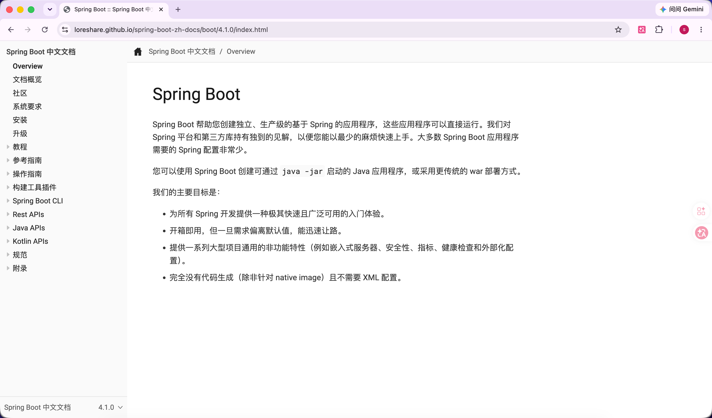

# Spring Boot 中文站

面向中文开发者的 Spring Boot 非官方中文站。当前提供 Spring Boot `4.1.0` 最新稳定版官方文档的中文化内容，覆盖教程、参考指南、操作指南、构建工具插件、Actuator REST API、规范和附录等主要章节。

后续 Spring Boot 发布新的稳定版后，本站会新增对应中文版本并更新 latest 入口；已经发布过的 GA 中文版本会继续保留，方便不同项目在维护期查阅匹配版本的文档。



## 在线访问

- 站点首页：<https://loreshare.github.io/spring-boot-zh-docs/>
- 当前最新稳定版：<https://loreshare.github.io/spring-boot-zh-docs/boot/4.1.0/>
- 入门教程：<https://loreshare.github.io/spring-boot-zh-docs/boot/4.1.0/tutorial/first-application/index.html>

## 版本支持

本站跟随 Spring Boot 官方 GA 版本维护中文文档。完整且最新的支持周期请以 [Spring Boot 官方支持页面](https://spring.io/projects/spring-boot#support) 为准；下表按 2026-06-11 官方页面默认展示的分支整理。

| 分支 | 首次发布 | OSS 支持结束 | 企业支持结束 |
| --- | --- | --- | --- |
| 4.1.x | 2026-06 | 2027-07 | 2028-07 |
| 4.0.x | 2025-11 | 2026-12 | 2027-12 |
| 3.5.x | 2025-05 | 2026-06 | 2032-06 |
| 3.4.x | 2024-11 | 2025-12 | 2026-12 |
| 3.3.x | 2024-05 | 2025-06 | 2026-06 |
| 3.2.x | 2023-11 | 2024-12 | 2025-12 |
| 2.7.x | 2022-05 | 2023-06 | 2029-06 |

## 这个站点做了什么

- 使用 Spring Boot 官方 `4.1.0` Antora 文档源生成中文静态站点。
- 翻译 Spring Boot 核心文档、Maven Plugin、Gradle Plugin 和 Actuator REST API。
- 保留 Java API、Kotlin API、Maven Plugin API 和 Gradle Plugin API 的官方英文外链，不生成中文镜像页面。
- 使用 DeepSeek 辅助翻译，并通过本地脚本检查代码块、链接、xref、include、Javadoc 宏和构建产物完整性。
- 支持 GitHub Pages 手动发布和 Docker 本地运行。

## 本地预览

安装依赖：

```bash
npm install
```

校验并构建站点：

```bash
npm test
npm run validate
npm run build
```

启动本地预览：

```bash
npm run serve
```

默认访问地址是 `http://localhost:8080`。

## 翻译维护

翻译只在本地执行，真实 DeepSeek API key 只通过环境变量或 `.env` 提供，不写入仓库，也不放进 GitHub Actions。

同步上游源、翻译全量页面并展开官方示例代码：

```bash
npm run sync:source
DEEPSEEK_API_KEY=你的本地密钥 npm run translate:all
npm run materialize:include-code
```

翻译后至少执行：

```bash
npm test
npm run validate
npm run build
npm run serve
```

`reports/deepseek-usage.jsonl` 会记录成功写入译文的 token 用量，便于后续估算翻译成本。

## GitHub Pages 发布

本站采用手动发布：本地翻译、校验、构建和预览确认后，提交代码并推送到 GitHub，再到 Actions 页面手动触发 Pages 发布 workflow。

GitHub Actions 只执行测试、同步固定上游源、校验、构建和部署静态站点；不执行 `translate:mvp` 或 `translate:all`，不读取 `DEEPSEEK_API_KEY`，也不随 `push` 自动上线。

详细约定见 `docs/GitHub Pages手动发布.md`。

## Docker 运行

构建镜像：

```bash
docker build -t spring-boot-zh-docs:4.1.0 .
```

运行容器：

```bash
docker run --rm -p 8080:80 --name spring-boot-zh-docs spring-boot-zh-docs:4.1.0
```

容器内使用 Node.js 构建静态站点，再由 nginx 暴露 `build/site`。由于 Antora playbook 使用当前 Git 仓库的 `HEAD` 作为本地内容源，Docker 构建上下文需要保留 `.git` 元数据；最终运行镜像只包含生成后的静态文件。

## 说明

本站是非官方中文站，内容以学习和查阅为目标。AI 翻译仍需要人工校对；如遇到含义不清、代码块缺失或链接异常，请优先对照 Spring Boot 官方英文文档。
